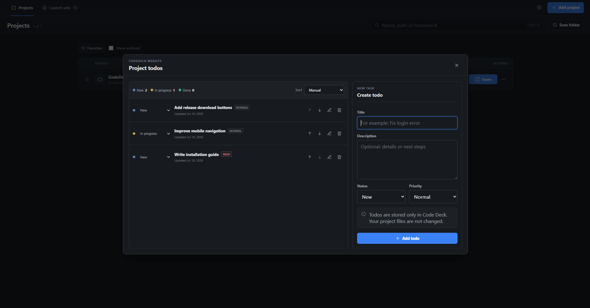

<p align="center">
  
</p>

<h1 align="center">CodeDeck</h1>

<p align="center">
  <strong>Your local development cockpit.</strong>
  <br>
  Organize projects, launch tools, run commands, manage Git, and start complete development setups from one desktop app.
</p>

<p align="center">
  <a href="https://github.com/JadnK/CodeDeck/releases/latest"><strong>Download CodeDeck</strong></a>
  ·
  <a href="docs/README.md">Documentation</a>
  ·
  <a href="https://github.com/JadnK/CodeDeck/issues">Report a bug</a>
</p>

<p align="center">
  <a href="https://github.com/JadnK/CodeDeck/actions/workflows/ci.yml">
    
  </a>
  <a href="https://github.com/JadnK/CodeDeck/releases/latest">
    
  </a>
  <a href="LICENSE">
    
  </a>
  
  
</p>

<p align="center">
  
</p>

## Why CodeDeck?

A local development workflow is usually spread across project folders, terminals, editors, Git tools, and browser tabs. CodeDeck brings those repeated steps into one searchable desktop dashboard.

Add an existing project, clone a repository, or create one from a template. Then open the correct IDE, run development commands, inspect Git changes, manage project tasks, and launch multi-project environments without rebuilding your setup every time.

CodeDeck is local-first: no account or server is required, and the app configuration stays on your machine.

## Features

| | |
|---|---|
| **Project dashboard** | Search, favorite, archive, scan, and organize local development projects. |
| **Project creation** | Add folders, clone HTTPS/SSH/local Git repositories, or create projects from built-in and custom templates. |
| **IDE and terminal launchers** | Open each project in its preferred IDE, terminal, or system file manager. |
| **Build and run** | Save commands, working directories, environment variables, build/run actions, and development ports. |
| **Live processes** | Follow stdout and stderr, inspect command status, stop active processes, and receive optional desktop notifications. |
| **Git workbench** | View diffs, manage branches, stage files, commit, fetch, pull, push, and resolve text merge conflicts. |
| **Launch sets** | Start several projects, commands, terminals, IDEs, folders, and URLs in parallel or sequence. |
| **Project todos** | Keep lightweight project-specific tasks with status, priority, and manual ordering. |
| **Local configuration** | Import and export settings, use light/dark/system themes, and keep CodeDeck available in the system tray. |
| **German and English UI** | Switch the application interface between German and English. |

## Screenshots

<table>
  <tr>
    <td width="50%">
      
      <br>
      <strong>Project details</strong>
    </td>
    <td width="50%">
      
      <br>
      <strong>Processes and live logs</strong>
    </td>
  </tr>
  <tr>
    <td width="50%">
      
      <br>
      <strong>Launch sets</strong>
    </td>
    <td width="50%">
      
      <br>
      <strong>Project todos</strong>
    </td>
  </tr>
</table>

## Download

Download the latest build from [GitHub Releases](https://github.com/JadnK/CodeDeck/releases/latest).

| Platform | Packages |
|---|---|
| Windows | `.msi` or setup `.exe` |
| macOS | `.dmg` |
| Linux | `.AppImage` or `.deb` |

CodeDeck can check published releases and install signed updates from inside the application.

## Getting started

1. Install and open CodeDeck.
2. Add an existing project folder, scan a projects directory, clone a repository, or create a project from a template.
3. Select the preferred IDE and configure saved commands or build/run actions.
4. Use the project dashboard for daily work, or create a launch set for workflows that need multiple projects and tools.

The complete page-by-page guide is available in [`docs/README.md`](docs/README.md).

### User guides

- [Dashboard](docs/pages/dashboard.md)
- [Add or create a project](docs/pages/new-project.md)
- [Project details and Git](docs/pages/project-details.md)
- [Project todos](docs/pages/todos.md)
- [Processes and logs](docs/pages/processes.md)
- [Launch sets](docs/pages/workspaces.md)
- [Settings](docs/pages/settings.md)

## Run from source

### Requirements

- Node.js 24
- pnpm 10.33 or newer
- Stable Rust toolchain
- [Tauri system dependencies](https://v2.tauri.app/start/prerequisites/) for your operating system

### Development

```bash
git clone https://github.com/JadnK/CodeDeck.git
cd CodeDeck

pnpm install --frozen-lockfile
pnpm tauri:dev
```

For frontend-only development:

```bash
pnpm dev
```

The frontend-only version is useful for interface work. Filesystem dialogs, process execution, IDE launching, system tray integration, and other native features require the Tauri application.

### Checks and production build

```bash
pnpm build
cargo check --manifest-path src-tauri/Cargo.toml
pnpm tauri:build
```

Generated platform packages are written to:

```text
src-tauri/target/release/bundle/
```

## Local data and command safety

- Adding a project does not move its folder or silently rewrite its source files.
- Cloning a repository does not automatically execute its project scripts.
- Commands only start after an explicit user action and run with the permissions of the current operating-system user.
- Imported commands are treated as untrusted and require confirmation before their first run.
- Only import configurations and custom templates from sources you trust.

## Project structure

```text
CodeDeck/
├── src/                         # React and TypeScript frontend
│   ├── app/                     # Application state and actions
│   ├── features/                # Projects, processes, settings, onboarding, and launch sets
│   └── shared/                  # Shared components, types, storage, and Tauri bridge
├── src-tauri/                   # Rust backend and native integrations
│   ├── src/
│   ├── capabilities/
│   └── tauri.conf.json
├── docs/                        # User documentation and screenshots
├── .github/workflows/           # CI and release workflows
├── CHANGELOG.md
└── CONTRIBUTING.md
```

## Roadmap

Current areas of interest include:

- SQLite-backed application storage
- Docker Compose controls
- A richer port and process overview
- Reusable launch-set templates
- A command palette

Ideas, bug reports, and focused feature requests are welcome in [GitHub Issues](https://github.com/JadnK/CodeDeck/issues).

## Contributing

Contributions are welcome.

Please read [`CONTRIBUTING.md`](CONTRIBUTING.md) before opening a pull request and follow the [`CODE_OF_CONDUCT.md`](CODE_OF_CONDUCT.md) when participating in the project.

Before submitting changes, run:

```bash
pnpm build
cargo check --manifest-path src-tauri/Cargo.toml
```

Useful links:

- [Open an issue](https://github.com/JadnK/CodeDeck/issues/new/choose)
- [View open issues](https://github.com/JadnK/CodeDeck/issues)
- [Read the changelog](CHANGELOG.md)
- [Read the security policy](SECURITY.md)

## Tech stack

- [Tauri 2](https://v2.tauri.app/)
- [Rust](https://www.rust-lang.org/)
- [React](https://react.dev/)
- [TypeScript](https://www.typescriptlang.org/)
- [Vite](https://vite.dev/)

## License

CodeDeck is available under the [MIT License](LICENSE).

---

<p align="center">
  Built for developers who want less setup and more time inside their projects.
  <br>
  If CodeDeck helps your workflow, consider giving the repository a ⭐.
</p>