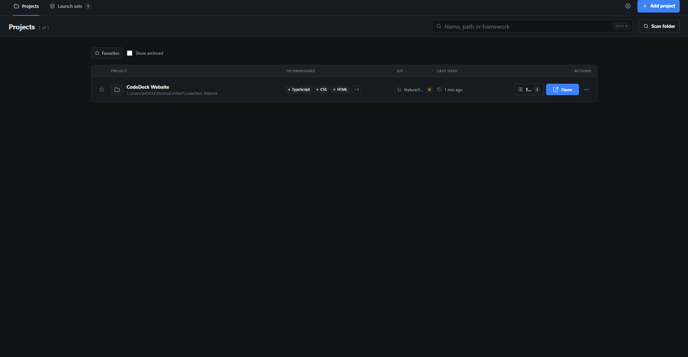
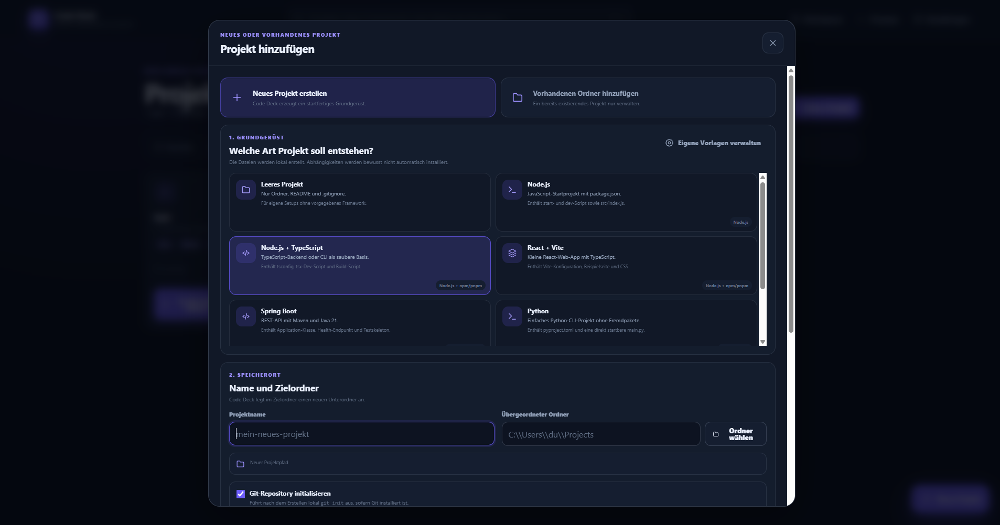
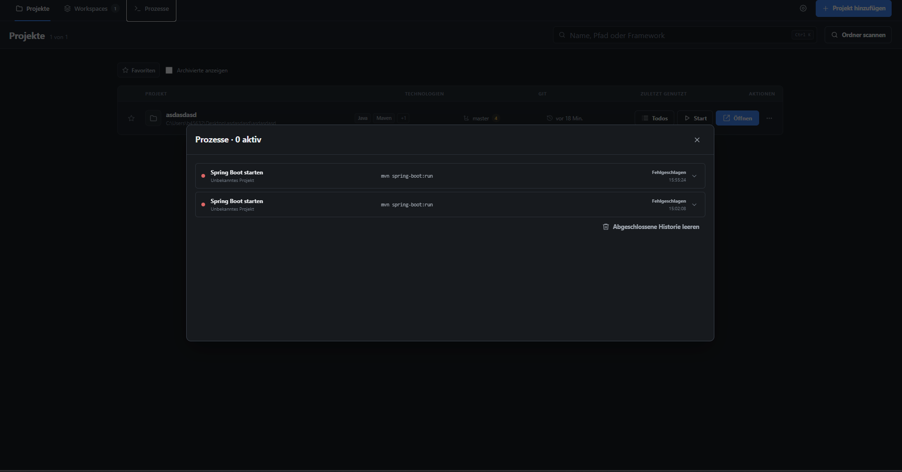
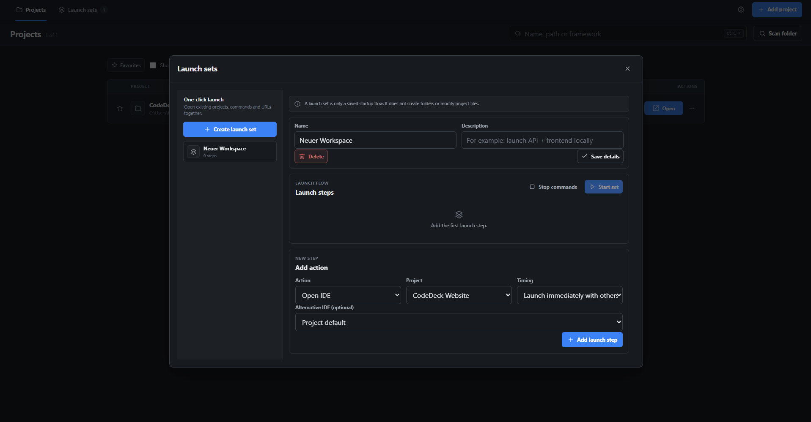
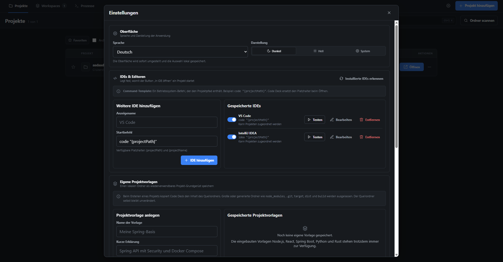

<p align="center">
  
</p>

<h1 align="center">Code Deck</h1>

<p align="center">
  A desktop app for keeping local development projects, launch commands and IDE shortcuts in one place.
</p>

<p align="center">
  <a href="https://github.com/JadnK/CodeDeck/actions/workflows/ci.yml"></a>
  <a href="https://github.com/JadnK/CodeDeck/releases"></a>
  
  
</p>



## What CodeDeck does

- Keep local projects in one searchable dashboard
- Open projects in the correct IDE
- Clone Git repositories or create projects from built-in and custom templates
- Build, run and stop projects with a configurable development port
- Manage branches, diffs, staging, commits, remotes and merge conflicts
- Keep project-specific todos with status, priority and manual ordering
- Stay available from the system tray and report finished commands through desktop notifications
- Start complete multi-project workspaces

The interface is available in German and English. This README uses the German labels where that makes the controls easier to find.

## Download

Download the latest version from
[GitHub Releases](../../releases/latest).

__If CodeDeck saves you time, consider starring the repository.__

## Where everything is

| Area | Where to find it | What it is for |
|---|---|---|
| Project search | Search field at the top | Searches names, paths, frameworks and branches |
| Favorites | **Favoriten** filter and star on each card | Keeps frequently used projects at the top |
| Add a project | **Neues Projekt** | Creates a starter, adds a folder or clones a Git repository |
| Scan folders | **Ordner scannen** | Looks below a base folder for Git repositories and known project files |
| Project actions | **Details** on a project card | IDE, terminal, build/run configuration, Git workbench and project settings |
| Project todos | **Todos** on a project row or in the project details | Create, prioritize, reorder and complete tasks for one project |
| Running commands | Terminal icon in the top-right actions | Live output, status, history and stop buttons |
| Multi-project setup | **Workspaces** in the top bar | Starts several project actions together |
| App configuration | **Einstellungen** in the top bar | IDE commands, templates, theme, folders and import/export |

## Documentation

For a detailed explanation of every page and feature, see the full user guide:

[Open the Code Deck documentation](docs/README.md)


### Guides

- [Dashboard](docs/pages/dashboard.md)
- [New Project](docs/pages/new-project.md)
- [Project Details](docs/pages/project-details.md)
- [Todos](docs/pages/todos.md) — create, prioritize, reorder and complete project tasks
- [Processes](docs/pages/processes.md)
- [Workspaces](docs/pages/workspaces.md)
- [Settings](docs/pages/settings.md)

## Adding projects

Click **Neues Projekt** on the dashboard. There are three modes.

### Create a new project

Choose **Neues Projekt erstellen** and select a starter:

- Empty project
- Node.js
- Node.js with TypeScript
- React with Vite
- Spring Boot with Maven and Java 21
- Python
- Rust CLI
- one of your own local templates

Then enter the project name and the parent folder. Code Deck shows the final path before it creates anything. Git initialization is optional.

Dependencies are not installed automatically. For example, a generated React project still needs `pnpm install` or `npm install` afterwards.



### Add an existing project

Choose **Vorhandenen Ordner hinzufügen** and select the project directory. Code Deck checks common files such as:

```text
.git
package.json
Cargo.toml
pom.xml
build.gradle
pyproject.toml
go.mod
Dockerfile
```

Detected package scripts are added as command suggestions. The project files themselves are not changed.

### Clone a repository

Choose **Repository klonen**, enter an HTTPS, SSH or local Git URL and select the destination folder. You can optionally choose a branch or tag and create a shallow clone. After cloning, CodeDeck detects the project metadata and adds the repository without running any project commands.

### Scan a projects folder

Use **Ordner scannen** when you already have many repositories below one folder, for example:

```text
C:\Users\you\Projects
```

The scan lists likely projects first. You decide which ones are added.

## Project details

Open **Details** from a project card.


The detail view contains the project-specific functions:

- **Open in …** starts the preferred IDE configured for the project
- **Terminal öffnen** opens a terminal in the project directory
- **Ordner öffnen** opens Explorer, Finder or the Linux file manager
- **Status aktualisieren** scans frameworks, scripts, Docker files and Git data again
- **Commands** stores commands such as `pnpm dev`, `mvn test` or `cargo run`
- **Build & Run** stores the project build command, run command and development port
- **Git** shows diffs, branches, staging, commits, fetch, pull, push and active conflicts
- the conflict resolver can use the current version, incoming version, both versions or a manual result
- project name, description, favorite state and preferred IDE can be edited here
- archiving hides the project from the normal dashboard without deleting its files

A command always runs with the project folder as its base directory. A custom working directory and environment variables can also be saved per command.

## Processes and logs

Starting a command opens the **Prozesse** panel. It stays available from the top bar afterwards.



Each run shows:

- project and command name
- running, successful, failed or stopped state
- start time and process ID when available
- stdout and stderr output
- a stop button for active processes

Finished entries can be removed from the history without touching the project. Optional desktop notifications report command success or failure, and closing the main window keeps CodeDeck available from the system tray.

## Workspaces

A workspace is useful when one task needs several projects, for example a frontend, API and local browser URL.



Open **Workspaces**, create a workspace and add actions. Supported actions are:

- open a project in an IDE
- open a terminal
- open the project folder
- run a saved or custom command
- open a URL

Actions can run in parallel or in sequence. **Start** runs the complete workspace; **Stop all** stops processes that were started by that workspace.

## Settings

Open **Einstellungen** in the top-right corner.



### Editors and IDEs

Each editor has a name and a command template. Examples:

```text
VS Code:       code "{projectPath}"
Cursor:        cursor "{projectPath}"
IntelliJ IDEA: idea "{projectPath}"
WebStorm:      webstorm "{projectPath}"
```

Available placeholders:

```text
{projectPath}
{projectName}
```

Keep `{projectPath}` in quotes so paths containing spaces work correctly.

### Terminal and default folder

You can set:

- the default folder used by project dialogs and folder scans
- a custom terminal launch command when automatic terminal detection does not fit your setup

Leaving the terminal command empty uses the platform-specific default.

### Custom project templates

Under **Eigene Projektvorlagen**, select a local folder and save it as a reusable template. When the template is used, Code Deck copies its files into the new project folder.

Generated or repository-specific folders such as these are skipped:

```text
.git
node_modules
target
dist
build
```

### Appearance and backups

Settings also contains:

- light, dark and system theme
- JSON export of projects, editors, workspaces and settings
- JSON import with confirmation before the current configuration is replaced
- an option to run the onboarding again

Imported commands are marked as untrusted and require confirmation before their first run.

## Keyboard shortcuts

| Shortcut | Action |
|---|---|
| `Ctrl/Cmd + K` | Focus project search |
| `Ctrl/Cmd + N` | Open the add-project dialog |
| `Esc` | Close the active dialog |

## Installation

Download a build from [GitHub Releases](https://github.com/JadnK/CodeDeck/releases).

| Platform | Package |
|---|---|
| Windows | `.msi` or setup `.exe` |
| macOS | `.dmg` |
| Linux | `.AppImage` or `.deb` |

Code Deck does not require an account or a server. The app configuration stays on the local machine.

## Running from source

### Requirements

- Node.js 24
- pnpm 10.33 or newer
- stable Rust toolchain
- the Tauri system dependencies for your operating system

### Development

```bash
pnpm install --frozen-lockfile
pnpm tauri:dev
```

Frontend only:

```bash
pnpm dev
```

The frontend-only version is useful for UI work, but filesystem dialogs, process execution and IDE launching require the Tauri app.

### Checks and build

```bash
pnpm build
cargo check --manifest-path src-tauri/Cargo.toml
pnpm tauri:build
```

Tauri writes platform packages below:

```text
src-tauri/target/release/bundle/
```

### Linux packages

On Ubuntu or Debian:

```bash
sudo apt-get update
sudo apt-get install -y \
  libwebkit2gtk-4.1-dev \
  libappindicator3-dev \
  librsvg2-dev \
  patchelf
```

On macOS, install the Xcode command-line tools:

```bash
xcode-select --install
```

On Windows, install Microsoft C++ Build Tools with the **Desktop development with C++** workload.

## Project structure

```text
CodeDeck/
├── src/
│   ├── app/                  # Main application state and actions
│   ├── features/
│   │   ├── onboarding/       # First-start guide
│   │   ├── processes/        # Process list and logs
│   │   ├── projects/         # Cards, creation, scanning and details
│   │   ├── settings/         # Editors, templates and app settings
│   │   └── workspaces/       # Workspace editor and runner
│   └── shared/
│       ├── components/       # Shared modal, icons and toasts
│       ├── lib/              # Storage, templates and Tauri bridge
│       └── types/            # Shared TypeScript models
├── src-tauri/
│   ├── src/                  # Rust commands and OS integration
│   ├── capabilities/         # Tauri permissions
│   └── tauri.conf.json       # Window and bundle configuration
├── docs/screenshots/         # Images used in this README
├── .github/workflows/        # CI and release workflows
├── CHANGELOG.md
└── CONTRIBUTING.md
```

## Local data and command safety

Code Deck reads project metadata but does not silently rewrite source files.

Commands are only started after a click. They run with the permissions of the signed-in operating-system user, so the same care applies as when running a command manually in a terminal.

Only import configurations and custom templates you trust.

## Releases

Before creating a release, keep the version in these files identical:

```text
package.json
src-tauri/Cargo.toml
src-tauri/tauri.conf.json
```

Then create and push the matching tag:

```bash
VERSION=1.1.0
git tag -a "v${VERSION}" -m "CodeDeck v${VERSION}"
git push origin "v${VERSION}"
```

The release workflow builds the platform packages and creates a GitHub release draft for review.

## Current plans

The next useful additions are:

- SQLite storage instead of browser-backed local storage
- Docker Compose controls
- a richer port and process overview
- workspace templates
- a command palette

## Contributing

For a small change, create a branch such as:

```text
feature/project-icons
fix/windows-terminal-launch
```

Before opening a pull request, run:

```bash
pnpm build
cargo check --manifest-path src-tauri/Cargo.toml
```

More details are in [CONTRIBUTING.md](CONTRIBUTING.md).

## License

See [LICENSE](LICENSE).

## Updates

CodeDeck checks published GitHub Releases on startup and can install signed updates directly inside the app. The updater is available from version 0.2.2 onward.
