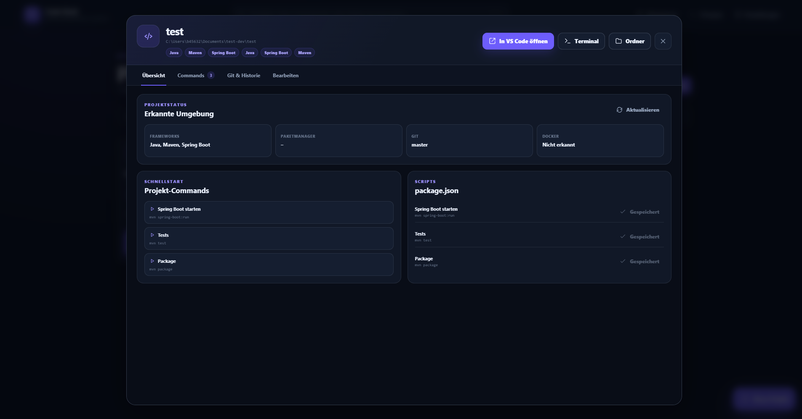

# Project Details



Open **Details** on a project card. This page contains everything that belongs to one project.

## Project information

You can edit:

- display name
- description
- favorite state
- preferred IDE
- archive state

The path identifies the local directory and is used as the default working directory for commands.

## Quick actions

| Action | What it does |
|---|---|
| **Open in …** | Opens the project with its preferred IDE |
| **Todos** | Opens the local task list for this project |
| **Terminal öffnen** | Opens a terminal in the project folder |
| **Ordner öffnen** | Opens Explorer, Finder or the Linux file manager |
| **Status aktualisieren** | Re-reads frameworks, scripts, Docker files and Git information |
| Archive | Hides the project from the normal dashboard without deleting its folder |
| Remove | Removes the project from Code Deck after confirmation; source files remain untouched |

## Commands

Commands are reusable actions such as:

```text
pnpm dev
pnpm test
mvn spring-boot:run
cargo run
docker compose up
```

Each command can have:

- a label shown in the interface
- the actual shell command
- an optional working directory relative to the project
- optional environment variables
- a display order

Starting a command opens a process entry where the output can be followed. A command is never run merely because it was imported or detected.

## Detected package scripts

For projects with `package.json`, Code Deck can show scripts from the `scripts` section. A suggestion is not yet a saved command. Save it when you want it to appear as a regular project action.

## Git information

For Git repositories, the page can show:

- current branch
- number of changed files
- latest commit hash, message and date

Use **Status aktualisieren** after changing branches or making commits outside Code Deck.

## When to use this page

Use the detail page when a project needs more than the single quick action shown on its dashboard card. It is also the correct place to fix a wrong IDE assignment, add a new command.
